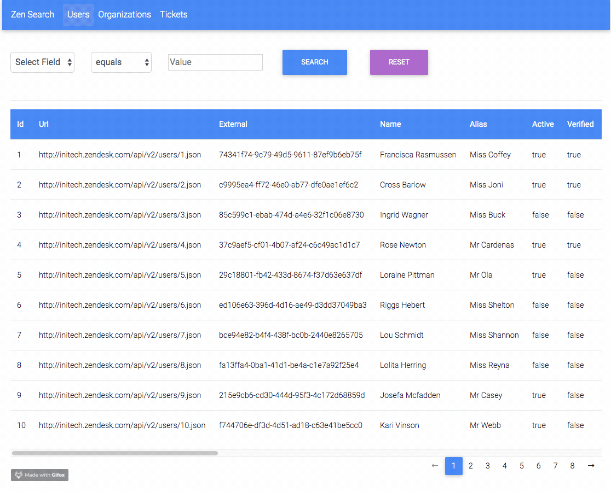
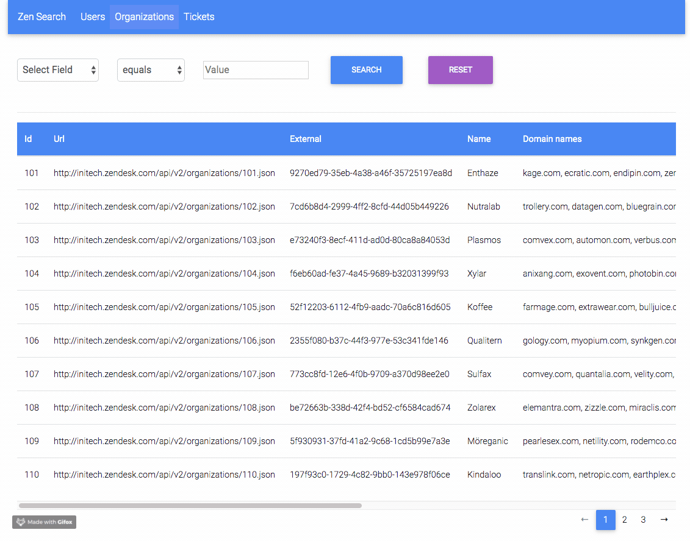
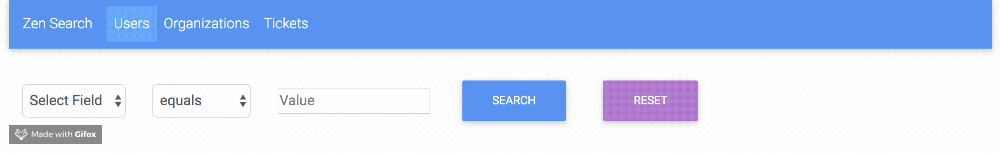
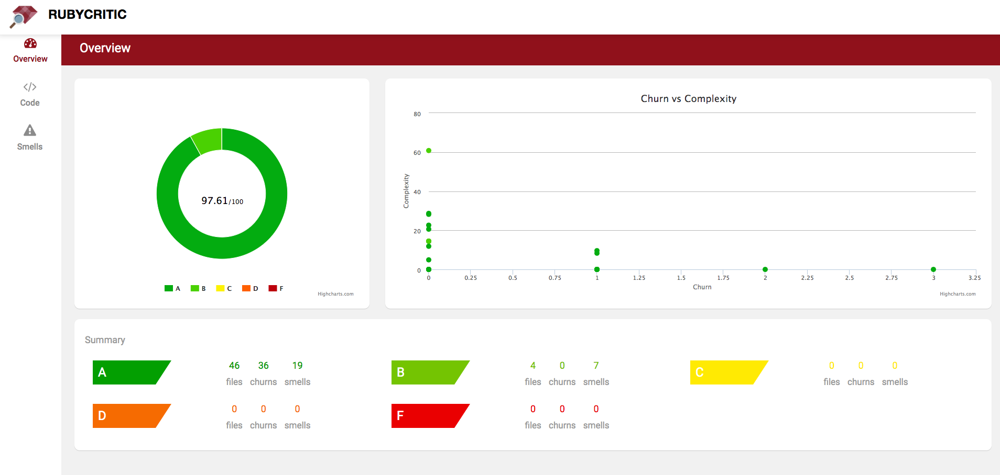
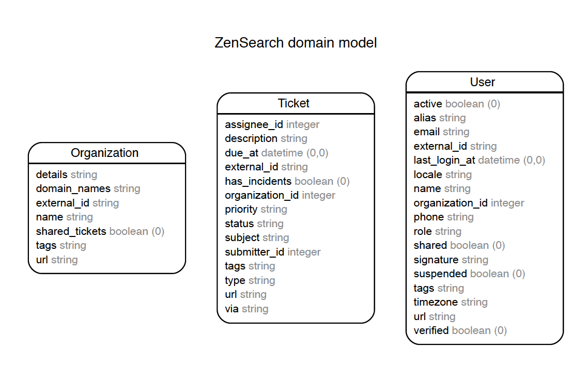

 Zen Search
 ================
 Search application based on ruby on rails.

When executing a search operation, where data exists, values from any related entities should be included in the results. The user should be able to search on any field and exact value matching is fine (e.g. “mar” won’t return “mary”). The user should also be able to search for empty values, e.g. where description is empty.

## Requirements

This application requires:
- Ruby 2.5.1
- Rails 5.2.3
- MySQL
- bundler -  `gem install bundler`

## Installation and Setup
- Download master  and unzip.
- Browse to extracted folder.
- Copy database.yml.example to database.yml and please setup MySQL user and database name.
- Use command `bundle install` to install gems from Gemfile.
- Setup table and seeds using `rake db:setup && rake db:seed`
- For execution in development mode please use `rails s` and access application at [http://localhost:3000](http://localhost:3000/)
- To use production mode please use `RAILS_ENV=production rake db:setup && rake db:seed`
- Precompile assets `RAILS_ENV=production rake assets:precompile`.
- Execute server `rails s -e production` and access application at [http://localhost:3000](http://localhost:3000/).

## Testing
- Travis Build can be seen at https://travis-ci.com/harssh/zen_search_test.
- Setup db `RAILS_ENV=test rake db:setup`
- To execute specs on local please use `bundle exec rspec -f d`

## Usage

- Visiting root path will lead you to users page and nav bar has links for organization and tickets.
- First select box can be used to select the column you would like to search.
- Second drop box will give you predicate/conditions to apply.
- Please enter required search value in Value text field.
- To search blank/empty value please use predicate `is blank` and value as `true`

## Design
Application is designed using bootstrap 4 and material framwork for UI.

## Code
- Rubocop , rails best practices and bundler-audit with brakeman are used to detect code quality and security issues.
- Rubycritic has been used to check code.

## Assumption and Model
- Some assumptions were taken on given data like we did not create any association between the three datasets to keep concentration on search implementation.

- Thre model classes were create User, Organization and Ticket.
- Assumed that application will be using relational database.

Thank you for your time and effort.

